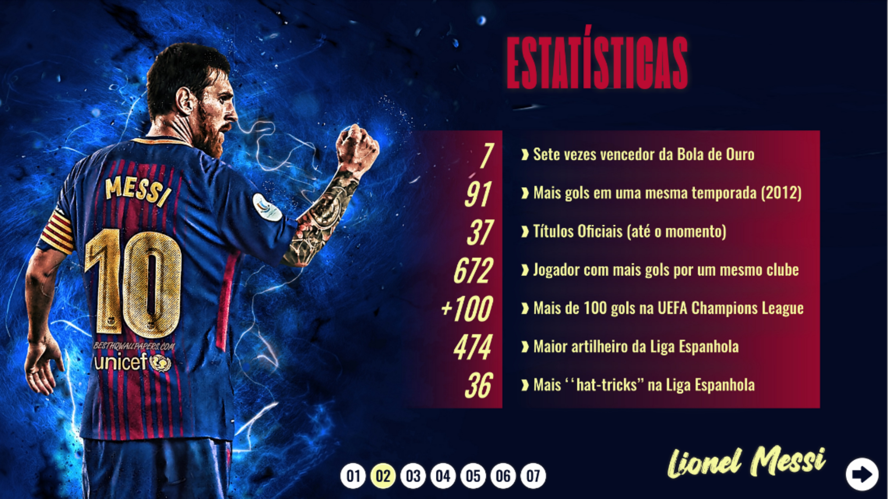
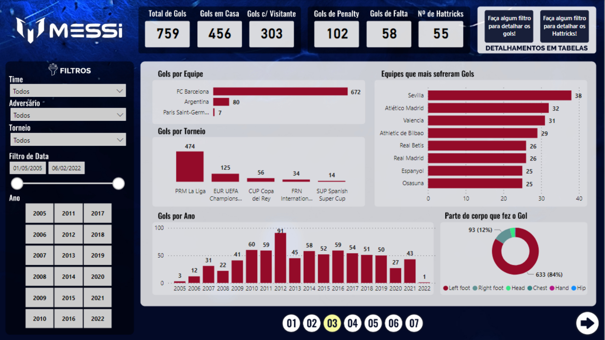
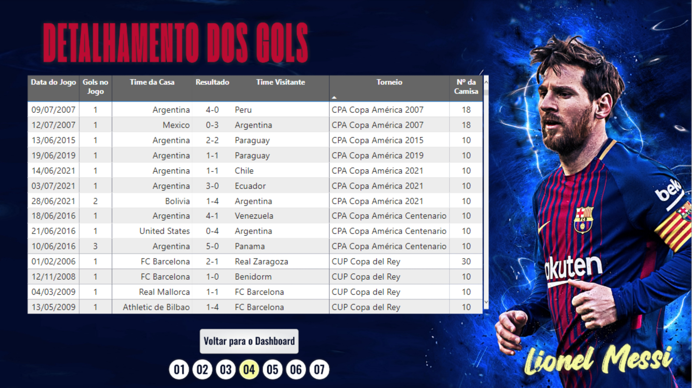
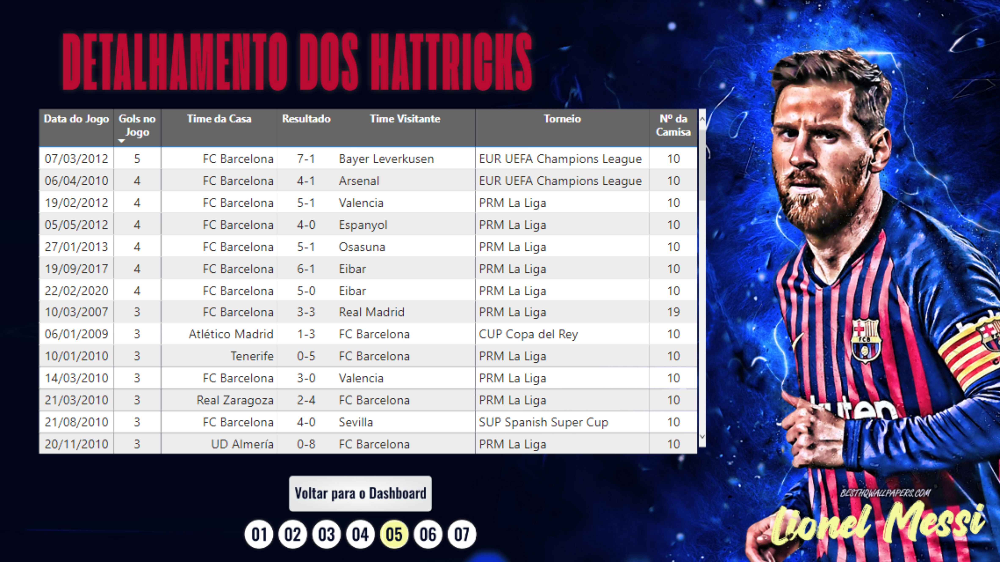

# Analise de Dados dos Gols de Lionel Messi

Projeto Feito em Power BI que mostra as estatísticas impressionantes do jogador de futebol Lionel Messi.
  

<b>01</b>

 

<b>02</b>

 

<b>03</b>

 

<b>04</b>

 

<b>05</b>

 

<b>06</b>

 

<b>07</b>

 

OBS: Arquivo em BI disponível para download!

 
https://heylink.me/ruanmarques